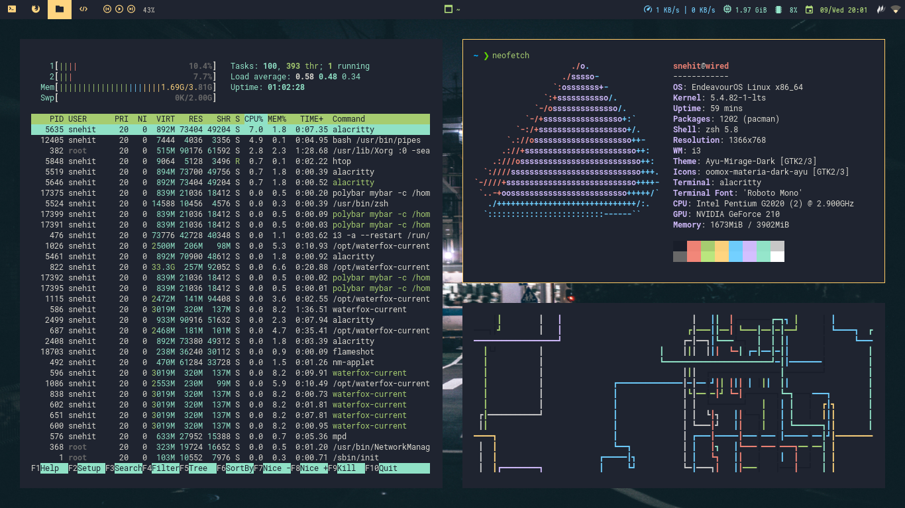
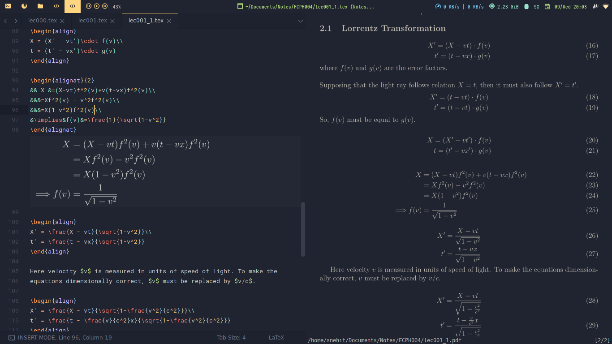
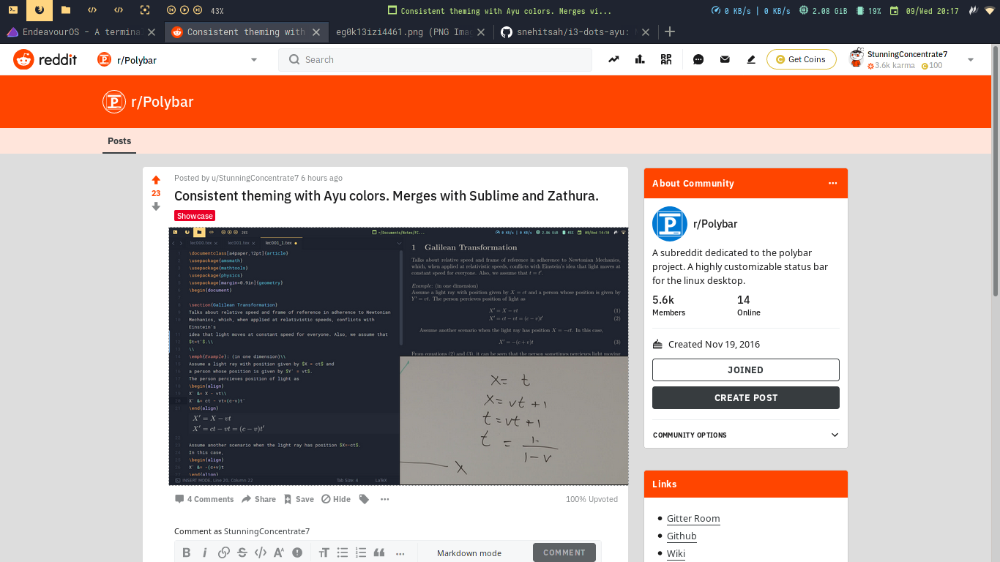

# i3-dots-ayu
My dotfiles for current setup. Uses Ayu Mirage theme.

## Screenshots

With 30px gaps

Latex editing without Gaps for a unified look in Sublime Text + Polybar + Zathura. (Please don't create an issue on GitHub sayng that my equations are wrong)

Editing while playing a YouTube video in floating player.

[Post on r/polybar](https://www.reddit.com/r/Polybar/comments/k9oc84/consistent_theming_with_ayu_colors_merges_with/). Opened in Firefox. Notice how the Firefox tabs bar merge in with the Polybar. Firefox is following GTK theme.

(Actually its Waterfox, not Firefox)

## Random Things to Know
  * ~~Fonts definitions in my Polybar are a mess. It works. And its still an unsolved mystery as to why it works.~~ Fixed the fonts config.
  * The only thing you want to copy from my i3 config are the color definitions.
  * Ayu Mirage colorscheme is used everywhere.
  * You also want to install Papirus Icons. But I obviously won't try to impose it.
  * I use EndeavourOS. Its great. Try it out someday.
  * Ayu Theme for various apps (VSCode, Sublime Text, vim etc.) can be found [here](https://github.com/ayu-theme)

## Installation

**Don't dare to continue before making backups of your existing dotfiles.**

Installation should be easy, since I don't have many external dependencies. Just clone this repo and copy paste files from my `.config` directory to your `~/.config` directory. I should warn again, don't copy paste the i3 folder since that would rewrite your keybindings too. Folders from `.icons` and `.themes` should go to the respective directories in your home folder. Gtk theme is applied using `lxappearance`.

I use `nitrogen` to set wallpaper. You can use whatever you like. I used `feh` earlier but `nitrogen` feels easier and faster to me.

You need to have `pavucontrol` installed for the right click on volume module to work. The mpd module requires a working mpd server. (wasn't that too obvious?)

I use Iosevka Nerd Font on my polybar. Sublime Text uses Roboto Mono.

I use this config on a 720p monitor. If you have a different resolution display, then change the dpi values in polybar config accordingly.

## Credits

Gtk theme borrowed from [dnordstrom/ayu-theme:ayu-mirage](https://github.com/dnordstrom/ayu-theme/tree/ayu-mirage). Has only the Mirage version afaik.

I have lost the wallpaper source. Sad. *crying neko sound*

## License

MIT

(I don't feel that GNU GPL v3 is right for this kind of repo. Personal opinion.)